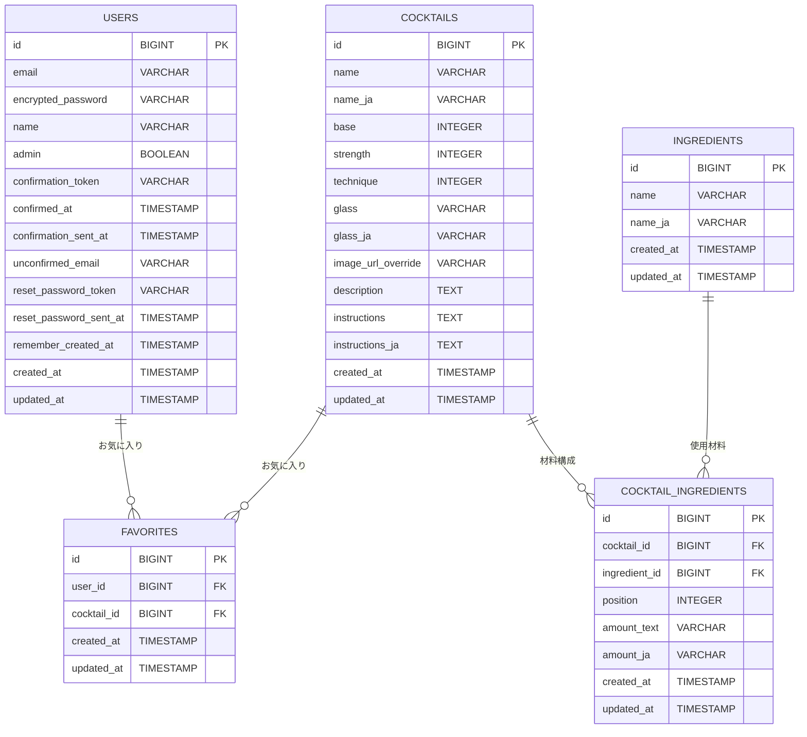

# Today's Cocktail - 今日の一杯が見つかるカクテルレシピ検索アプリ


## サービス概要

Today's Cocktail は、「カクテルをもっと身近に」という想いから生まれた、無料のカクテルレシピ検索サービスです。
ベースとなるお酒や材料、人気順など、複数の条件からレシピを検索でき、気に入った一杯はお気に入りとして保存できます。
誰でも迷わず使える直感的なUIと、「今日の一杯」をランダムに提案する機能により、カクテル初心者でも安心して新しいお酒に挑戦できる体験を提供しています。

### サービスURL

**https://todayscocktails.com**

レスポンシブ対応済のため、PCでもスマートフォン、タブレットでも快適にご利用いただけます。

### ゲストユーザーアカウント

- **Email**: `guestuser@example.com`
- **Password**: `password123`

お気に入り保存機能などログインが必要な機能を試す際にご活用ください。

---

## サービス開発の背景

開発者自身、休日の趣味や気分転換として外に一杯飲みに行くことが好きなのですが、いつもビールやワインなど同じメニューを頼んでしまい、どこかマンネリを感じていました。また、海外生活や旅行の中で現地のバーに行くと、「ネグロニ」や「オールドファッション」など、日本の居酒屋ではあまり見かけないカクテルがメニューに並んでいることが多く、興味はあるものの味や見た目のイメージがつかず、注文を躊躇してしまうことがよくありました。

「いつかはカクテルを勉強して、もっといろいろな種類のドリンクを楽しめるようになりたい」と思いながらも、日本語で気軽にカクテルを学べるサービスがなかなか見つからず、あるとしても「広告が多く使いづらい」、「情報量が多すぎて初心者には難しい」「デザインが古くユーザー体験が悪い」といった印象が強く、理想的なアプリやサービスが見つからない状況でした。

それなら、カクテル初心者向けに日本語でわかりやすく情報が整理された、シンプルでモダンなカクテル図鑑アプリを自分で作ろう！と思い、開発することにしました。

---

## 主な実装機能

### カクテル一覧表示機能

現時点で登録済みのレシピ40種類以上を閲覧することができます。人気順での並び替えも可能です。


### カクテル詳細ページ表示機能

カクテル名、由来などの説明文、カクテルごとの画像、材料一覧、レシピなどの詳細情報を表示します。


### 日替わりレコメンド機能

「今日の一杯」を日替わりでランダムに提案します。


### 検索・フィルタリング機能

カクテル名・材料のキーワード検索に加え、ベースとなるお酒・つくりかた・アルコール度数でのフィルタリングが可能です。


### お気に入り機能

気に入ったカクテルを保存して一覧表示できます。（ログインユーザー限定）


### ユーザー認証機能

ユーザー登録・ログイン・パスワードリセットが可能です。


### アカウント設定機能

アカウント設定画面から、ユーザー名・パスワード変更が可能です。


### 管理者機能

詳細画面からカクテル情報の編集が可能です。（管理者ユーザー限定）


---

## 使用技術一覧（Tech Stack）

| カテゴリ               | 採用技術                                                                                                                        |
| ---------------------- | ------------------------------------------------------------------------------------------------------------------------------- |
| フロントエンド         | React 19 / TypeScript / Vite 7 / React Router 7 / Tailwind CSS 3 / shadcn/ui（Radix UI）                                        |
| バックエンド API       | Ruby 3.4.6 / Rails 8.0.3（API モード）                                                                                          |
| データベース           | Supabase CLI / Cloud（PostgreSQL 17）                                                                                           |
| 認証                   | Devise / devise-jwt                                                                                                             |
| 外部API連携            | OpenAI API（生成・翻訳） / TheCocktailDB API（カクテル情報） / Unsplash API（画像） / Resend API（メール送信）                  |
| インフラ・ホスティング | Vercel（フロントエンド） / Render（バックエンド API） / Cloudflare DNS                                                          |
| CI/CD                  | GitHub Actions（lint / test） / Vercel & Render Deploy Hooks                                                                    |
| テスト                 | Vitest 4（フロント） / RSpec（Rails API）                                                                                       |
| UI/UX デザイン         | Figma / Figma Make                                                                                                              |
| 開発支援・コード整形   | ESLint 9 / Prettier 3 / Husky 9 / lint-staged 16 / RuboCop                                                                      |
| 開発環境               | Git / Docker / Docker Compose / VS Code / GitHub Copilot / Codex（Sonnet 4.5 / gpt-5 / gpt-5-codex） / Colima（軽量Docker環境） |

---

## インフラ構成図


- **ホスティング**: 運用コストを抑えるため、フロントエンドは Vercel、バックエンドは Render、データベースは Supabase Cloud（PostgreSQL）を採用しました。いずれも無料プランでの運用が可能です。
- **デプロイフロー**: GitHub の main ブランチに Push すると GitHub Actions が自動で lint / test を実行し、すべてのチェックを通過した場合にのみ Vercel（フロントエンド）および Render（バックエンド）へ自動デプロイされます。
- **DNS 管理**: 独自ドメインは Cloudflare DNS で管理しています。
- **データストア**: バックエンド API から Supabase Cloud（PostgreSQL）へ接続してデータを保存・取得します。また必要に応じて Rails.cache を利用し、応答速度とパフォーマンスを向上させています。
- **外部 API 連携**: バックエンドから以下の外部 API を利用しています。
  - OpenAI API（説明文生成・翻訳）
  - Unsplash API（画像取得）
  - Resend API（メール送信）
  - TheCocktailDB API（カクテル情報）

---

## ER 図



- **USERS**
  ユーザーアカウント情報を管理するテーブルです。メールアドレス・パスワード・管理者フラグ・認証関連のトークンなどを保存。

- **COCKTAILS**
  カクテルの基本情報を格納するメインテーブルです。名前、ベース種、度数、作り方、説明文、画像 URL などを管理。

- **INGREDIENTS**
  材料のマスターデータ。材料名（日本語・英語）を保持。
  ※カクテルとは直接紐付かず、中間テーブルを介して多対多関係を形成。

- **COCKTAIL_INGREDIENTS**
  カクテルと材料を結びつける中間テーブル。
  どのカクテルにどの材料がどれくらい必要か（分量）を管理し、さらに position により表示順序も保持。

- **FAVORITES**
  ユーザーがお気に入り登録したカクテルを管理する中間テーブル。
  1ユーザーは複数のお気に入りを持つことができ、1カクテルは多くのユーザーにお気に入り登録される可能性あり。

---

## 採用技術の選定理由

今回開発したアプリで使用している技術を採用した理由について記載します。基本的な選定軸としては以下です。

1.  スタートアップやメガベンチャー等、多くのWebサービス企業で採用実績があること
2.  日本語での学習教材や公式ドキュメントが豊富で、情報をキャッチアップしやすいこと
3.  個人開発でも継続して運用しやすく、学習コスト・費用・環境構築の面でボトルネックにならないこと

---

### バックエンド: Ruby / Ruby on Rails (API モード)

#### 検討技術

- TypeScript / Node.js / Go / PHP / Java 等

#### 採用理由

- Progate や Rails チュートリアルなど初学者向け教材が充実しており、他フレームワークと比較しても学習開始のハードルが低いこと
- 開発効率が高く短期間で MVP を構築しやすい特性から、2025年現在も Web 系スタートアップを中心に採用され続けており、未経験・ジュニア層向け求人も比較的多いこと
- オブジェクト指向や MVC の設計思想を学ぶことで、他の言語・フレームワークにも応用しやすい基礎を身につけられること

#### 懸念点

- モノリシック構成になりやすく、マイクロサービス化しにくい
  → 小規模 Web サービスであり、運用上の問題はないと判断
- 動的型付け言語であるため、型安全性に課題がある
  → RSpec を用いたテストで一定の品質を担保できると判断

---

### フロントエンド: TypeScript / React

#### 検討技術

- Ruby on Rails (Hotwire) / Vue.js / Next.js 等

#### 採用理由

- 過去に JavaScript / React を学習した経験があり、キャッチアップが容易だったため
- 一般的な企業でも React / TypeScript の採用が主流化しており、学習教材・コミュニティが豊富であること
- Next.js についても検討したが、Rails と組み合わせた場合、API ルーティングや SSR / SSG の責務分離が複雑化する可能性があると判断し、本プロジェクトではよりシンプルに運用できる React を採用

#### 懸念点

- Next.js の Image Optimization などの最適化機能が利用できない
  → 本プロジェクトは SEO 要件や SSG / ISR を必要としない構成であり、MVP作成段階では追加の学習コストに見合うメリットが小さいと判断して見送り（今後導入・移行することも検討中）

---

### インフラ: Render / Vercel / Supabase

#### 検討技術

- AWS（ECS Fargate, RDS）等

#### 採用理由

- 過去の AWS 経験や Terraform などの IaC 活用も見込んで当初は AWS 構成を検討していたが、フロントとバックエンドをそれぞれ ECS Fargate で運用し、RDS を配置する構成では最小スペックでも月額 6,000〜10,000 円規模のランニングコストが発生する見込みであったため断念
- 今後も継続して開発・運用したい個人プロジェクトであることから、低コストでデプロイ・ホスティング・データベースを一気通貫で扱える Render / Vercel / Supabase の組み合わせを採用

#### 懸念点

- Render / Vercel の無料枠・小規模プランでは、同時接続数やスケール性能に制限がある
  → 個人プロジェクトのユースケースでは十分と判断
- Render・Vercel・Supabase の 3 つのサービスにまたがって運用する構成となるため、設定管理やトラブルシューティングが分散しやすい
  → IaC での完全な一元管理は難しいが、費用面でのメリットを考慮し個人開発の規模では許容できると判断。また、各プラットフォームの UI（デプロイ操作やログ確認など）に実際に触れ、使いやすさを感じたことも理由

---

### DBエンジン: Supabase Cloud（PostgreSQL）

#### 検討技術

- RDS / Aurora MySQL 等

#### 採用理由

- 前職で扱っていた RDS / Aurora（MySQL 系）を利用できれば、既存の運用知識を活かせる点でメリットが大きいと考えていましたが、個人開発として継続運用するにはコストが高く現実的ではないため断念
- Supabase の無料枠では PostgreSQL のみが提供されており、環境構築の手軽さ・追加料金なしでの運用が可能だったこと
- PostgreSQL は拡張機能が豊富で世界的にもシェアが伸びているため、今後のキャリアにおいて学習リターンが大きいと判断

---

### CI / CDツール : GitHub Actions

#### 検討技術

- AWS Codeシリーズ など

#### 採用理由

- GitHub とネイティブに連携でき、設定がシンプルで扱いやすかったため
- 無料枠が十分で、個人開発でも運用コストを気にせず利用できるため

---

### 認証 : devise(gem)

#### 検討技術

- Supabase Auth / Firebase Authentication など

#### 採用理由

- Railsチュートリアルでログイン機能の実装を実践したこともあり、せっかくなら認証部分を自分で実装する経験を積みたいと考えたため

---

## 工夫した点

### 1. 生成AI（OpenAI API）を使った材料・レシピ文の翻訳および 0→1 のコンテンツ生成

---

### 元データについて（Raw Cocktail DB）

本プロジェクトでは、海外のオープンソースのカクテルデータベースを初期データとして利用しました。
提供されるデータは、**英語圏向けの分量・材料名・レシピ記述を前提** に構成されています。

### 典型的な元データ

```json
{
  "name": "Margarita",
  "ingredients": [
    { "name": "Tequila", "amount": "1 1/2 oz" },
    { "name": "Triple sec", "amount": "1/2 oz" }
  ],
  "instructions": "Rub the rim of the glass with lime slice..."
}
```

### 海外の初期データを使用したことによる課題

当初、上記の海外データをDeepL翻訳 APIを活用して日本語に翻訳しようと考えていましたが、実際に試してみると以下のような課題が発生しました。

- **計量単位が “oz / dash / tsp” など海外仕様のため、日本人には直感的に分量が分かりにくい**
- **材料名が英語圏前提で、直訳すると意味が通じづらい（例: Triple sec, Half-and-half, Cream of coconut）**
- **instructions（作り方）が英語圏の言い回しや表現になっており、直訳すると不自然で読みにくい**

これにより、ただそのままDeepL で翻訳しただけではかなり不自然な日本語になってしまい、手動で更新するとなるとかなりの労力が必要になる状況でした。

---

## 上記課題にどうアプローチしたか

海外データを日本語ユーザー向けに自然なレシピ形式へ変換するため、翻訳処理を OpenAI GPT-5 API に集約し、Rails の `TranslationService` として実装しました。
材料名・分量・作り方といった表現の揺れをコード側で統一し、自動化と一貫性を両立しています。

---

### 1. 翻訳タスクを独自実装し処理の自動化を実施

`TranslationService` に翻訳ロジックを集約し、材料名・分量・グラス名・作り方を GPT-5 によって日本語化する仕組みを実装しました。

主な処理:

- 材料名の日本語化
- 分量を日本向け単位へ変換（oz → ml など）
- グラス名を日本向けに意訳
- 作り方を自然な日本語の手順へ変換

<details>
<summary>実装コード（抜粋）</summary>

```ruby
# 材料名を翻訳
def translate_ingredient_name(name)
  prompt = <<~PROMPT
    以下のカクテル材料名を日本語に翻訳してください。
    一般的な材料はカタカナに、説明的な材料は自然な日本語に。
    翻訳結果のみを返してください。

    材料名: #{name}
  PROMPT

  translate(prompt)
end
```

```ruby
# 分量の正規化
def translate_measure(measure)
  prompt = <<~PROMPT
    以下の分量表現を日本人に馴染みやすい単位に変換してください。
    1 oz = 30ml, dash = 1〜2滴 など。

    元の分量: #{measure}
  PROMPT

  translate(prompt)
end
```

</details>

---

### 2. 説明文（description）の 0→1 生成

各カクテルについて、由来・味わい・飲むシーンを含む
**120文字前後の紹介文** を GPT-5 で生成する仕組みを実装しました。
全カクテルで統一された文体・世界観を保つことができます。

<details>
<summary>実装コード（抜粋）</summary>

```ruby
def generate_description(cocktail_name, base, strength, ingredients_list)
  prompt = <<~PROMPT
    あなたはカクテル文化に詳しいプロのライターです。
    次の条件で120文字前後の紹介文を書いてください。
    - 由来・味わい・飲むシーンを含める
    - 文体は専門誌のように統一
    - カクテル名は本文に含めない

    カクテル名: #{cocktail_name}
    ベース: #{base}
    材料: #{ingredients_list.join(', ')}
  PROMPT

  translate(prompt)
end
```

</details>

---

### 3. メタ情報の自動推定

検索性向上のため、材料構成からベーススピリッツを推定したり、
カクテル名からアルコール強度（light / medium / strong）を分類する処理を追加しました。

<details>
<summary>実装コード（抜粋）</summary>

```ruby
def determine_base(ingredients_list)
  prompt = <<~PROMPT
    From the ingredient list, return one of:
    gin, rum, whisky, vodka, tequila, wine, beer.

    Ingredients: #{ingredients_list.join(', ')}
  PROMPT

  translate(prompt)&.downcase || "vodka"
end
```

```ruby
def determine_strength(cocktail_name, ingredients_list)
  prompt = <<~PROMPT
    以下のカクテル名から強さを分類してください。
    JSON形式で intensity（ライト/ミディアム/ストロング）を返すこと。

    カクテル名: #{cocktail_name}
  PROMPT

  JSON.parse(translate(prompt))["intensity"]
end
```

</details>

---

### 4. Rake タスクによるパイプライン化

翻訳・説明文生成・データ更新を **数コマンドで再現できるワークフロー** として構築しました。

- `cocktails:import`（元データ取得＋基礎翻訳）
- `cocktails:translate_all`（不足項目の翻訳）
- `cocktails:generate_descriptions`（説明文の生成）
- `cocktails:regenerate_translations`（個別再翻訳）

<details>
<summary>実装コード（抜粋）</summary>

```ruby
namespace :cocktails do
  task import: :environment do
    CocktailImporter.new.run
  end

  task translate_all: :environment do
    Cocktail.find_each { |c| c.translate_all_fields! }
  end

  task generate_descriptions: :environment do
    Cocktail.find_each { |c| c.generate_description! }
  end
end
```

</details>

---

## 結果

上記対応により、もとの英語データを活用して、日本語ユーザーがそのまま再現できるレシピデータを格納することが可能となりました。また各カクテルごとに統一された説明文・世界観をアプリ内で構築することができ、アプリ全体のUXが向上できたと考えています。Railsタスクの実装やOpen AI APIの活用など、技術面でもチャレンジングな経験を得ることができ、自分なりによく工夫できた点だと感じています。

---

## カクテル一覧・詳細・検索機能のパフォーマンス改善

初期実装では、検索条件を変えるたびにほぼ全件のデータを取得してしまい、一覧ページのスクロールでも引っかかりが発生するなど、全体的にパフォーマンスが不足している状態でした。
こうした課題を解消するため、AIを倒産しながらデータ取得・キャッシュ・クエリ処理・フロント側のレンダリングの見直しを行いました。

---

### 1. クエリ最適化とキャッシュ導入でレスポンスを改善

検索条件に応じて必要なデータだけ取得するようにクエリを見直し、
さらに `Rails.cache` を導入して、同じ条件でのアクセスが高速化されるように改善しました。

- 検索クエリの最適化（必要なデータのみ取得）
- `includes` を使った N+1 回避
- `Rails.cache` による検索結果・詳細データのキャッシュ（1〜24 時間で期限管理）

<details>
<summary>実装コード（抜粋）</summary>

```ruby
# 詳細ページの高速化
def show
  cache_key = "cocktail_#{params[:id]}_detail"

  cocktail = Rails.cache.fetch(cache_key, expires_in: 24.hours) do
    Cocktail.includes(:ingredients).find(params[:id])
  end

  render json: cocktail
end
```

```ruby
# 検索クエリの最適化
def self.filtered(params)
  scope = all
  scope = scope.where(base: params[:base]) if params[:base].present?
  scope = scope.where("name_ja ILIKE ?", "%#{params[:keyword]}%") if params[:keyword].present?
  scope.includes(:cocktail_ingredients, :ingredients)
end
```

</details>

---

### 2. React 側でブラウザキャッシュを追加

同じ検索条件やページを再度開く場合は、SessionStorage から即座に結果を返すようにしました。
これにより、リロードしても API を叩かずに瞬時に画面が復元されるようになりました。

<details>
<summary>実装コード（抜粋）</summary>

```ts
export async function fetchWithCache(key: string, fetcher: () => Promise<any>) {
  const cached = sessionStorage.getItem(key);
  if (cached) return JSON.parse(cached);

  const data = await fetcher();
  sessionStorage.setItem(key, JSON.stringify(data));
  return data;
}
```

</details>

---

### 3. 不必要に大量データを取得しないようにページネーション機能を実装

一覧ページでは毎回 51 件のデータを取得していたため、
実際に表示する 8〜9 件のために通信負荷・描画負荷がかかっていました。

これをページネーションに変更し、
**1 回あたりの取得件数を 85% 削減** しました。

<details>
<summary>実装コード（抜粋）</summary>

```ruby
# Rails 側で limit / offset を制御（例）
scope :paginate, ->(page, per) { limit(per).offset((page - 1) * per) }
```

</details>

---

### 4. DB にインデックスを追加

`name` や `base` を検索条件に使っていたため、
全件スキャンが発生して検索が遅くなっていました。

そこで頻出カラムに index を追加し、検索速度を改善しました。

<details>
<summary>実装コード（抜粋）</summary>

```ruby
class AddIndexesToCocktails < ActiveRecord::Migration[8.0]
  def change
    add_index :cocktails, :name, if_not_exists: true
    add_index :cocktails, :name_ja, if_not_exists: true
    add_index :cocktails, :base, if_not_exists: true
  end
end
```

</details>

---

### 5. 画像の遅延ロードや再レンダリング削減に対応

フロント側では、不要な再レンダリングの見直しと、画像の遅延ロードに対応しました。

<details>
<summary>実装コード（抜粋）</summary>

```tsx

```

</details>

---

### 結果

ローカルでの測定では、以下のようにパフォーマンスが改善され、UXを大きく向上させることができ、パフォーマンス改善の手段を知るいいきっかけとなりました。

| 項目         | 改善前 | 改善後  | 改善率    |
| ------------ | ------ | ------- | --------- |
| Today's Pick | 9.65秒 | 0.057秒 | 約169倍   |
| カクテル詳細 | 12.4秒 | 0.055秒 | 約220倍   |
| データ転送量 | 51件   | 8〜9件  | 約85%削減 |

## 今後の開発ロードマップ

現時点ではMVPリリースとなっており、今後は以下の機能を追加開発していく予定です。

- カクテル画像アップロード機能の実装（現在は外部URLのみ取得）
- 「定番」「簡単」などのタグ付け機能の追加、およびフィルタリング項目への反映
- ソーシャルログイン機能（LINE / Google など）の導入
- コメント投稿機能の追加
- カクテルレシピの拡充
- プレミアムユーザー向け機能（課金）の導入
- 英語対応

---

## 開発者

**伊藤 彬人（Akito Ito / iakito-dev）**

- **GitHub**: [https://github.com/iakito-dev](https://github.com/iakito-dev)
- **ポートフォリオ**: [https://iakito-dev.github.io/Resume_JP/](https://iakito-dev.github.io/Resume_JP/)
- **サービスURL**: [https://todayscocktails.com](https://todayscocktails.com)
