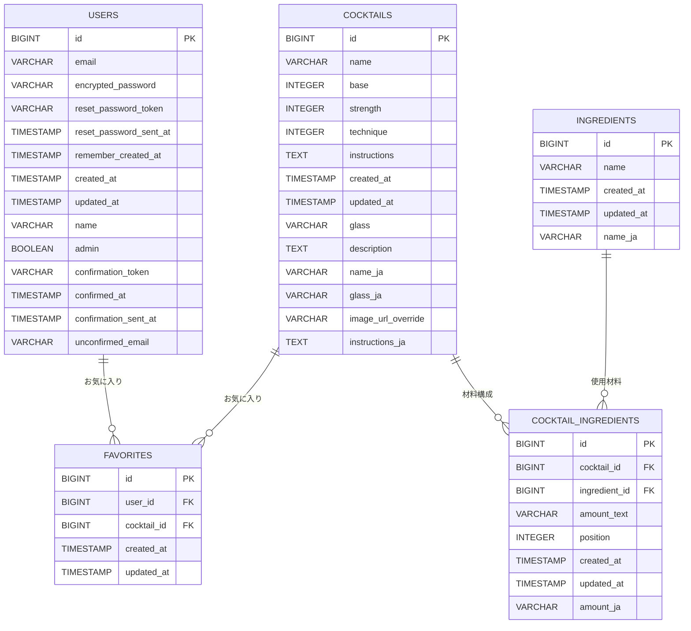

# Today's Cocktail 🍸

## サービス概要

Today's Cocktail は、「カクテルをもっと身近に」という思いから生まれたカクテルレシピ検索サービスです。
ベース種類・材料・人気順など複数の軸でレシピ検索ができ、気に入った一杯はお気に入りとして保存できます。
視覚的にわかりやすい画像と直感的な UI により、初心者でも安心して新しいカクテルに出会える体験を提供します。

### サービスURL

**https://todayscocktails.com**

### ゲストユーザーアカウント

- **Email**: `guestuser@example.com`
- **Password**: `password123`

---

## サービス開発の背景

もともと学習系のコンテンツをなにか作ってみたいと思っていたなかで、海外のバーでドリンクを注文する際に、名前だけでは味や見た目が想像できないカクテルがメニューにずらっと並び、注文に戸惑ってしまうことがありました。

普段は無難にワインやビールを頼んでしまうのですが、せっかくなら種類の豊富なカクテルにも詳しくなり、お酒にあまり詳しくない自分でも自信を持ってカウンターで注文できることができたらより世界が広がると感じました。

カクテルアプリをいくつか探してみたところ、日本語ではUIが洗練されていて、ベースや材料、由来などの情報がシンプルに整理されたサービスが見つからず、それなら自分でつくってみようと思い挑戦しました。

### 提供したい価値

本アプリでは、このような開発者自身の体験をもとに、初心者でも直感的に雰囲気が分かる画像や、カクテルの起源・由来・アルコール度数などの情報を分かりやすく整理し、カクテル初心者でも**安心して新しい一杯を選べる**ことを目指しています。

---

## 主な実装機能

- **カクテル一覧表示**：ベース種類・材料・人気順など複数の軸で検索・フィルタリング
- **カクテル詳細ページ**：名前、説明文、画像、材料、レシピなどの詳細情報を表示
- **日替わりレコメンド機能**：「今日の一杯」を日替わりで提示
- **お気に入り機能**：気に入ったカクテルを保存・管理（ログインユーザー限定）
- **ユーザー認証機能**：ユーザー登録・ログイン・パスワードリセット
- **管理者機能**：カクテル情報の作成・編集（管理者ユーザー限定）

---

## 使用技術一覧（Tech Stack）

| カテゴリ               | 採用技術                                                                                                                        |
| ---------------------- | ------------------------------------------------------------------------------------------------------------------------------- |
| フロントエンド         | React 19 / TypeScript / Vite 7 / React Router 7 / Tailwind CSS 3 / shadcn/ui（Radix UI）                                        |
| バックエンド API       | Ruby 3.4.6 / Rails 8.0.3（API モード）                                                                                          |
| データベース           | Supabase CLI / Cloud（PostgreSQL 17）                                                                                           |
| 認証                   | Devise / devise-jwt                                                                                                             |
| 外部API連携            | OpenAI API（生成・翻訳） / TheCocktailDB API（カクテル情報） / Unsplash API（画像） / Resend API（メール送信）                  |
| インフラ・ホスティング | Vercel（フロントエンド） / Render（バックエンド API） / Cloudflare DNS                                                          |
| CI/CD                  | GitHub Actions（lint / test） / Vercel & Render Deploy Hooks                                                                    |
| テスト                 | Vitest 4（フロント） / RSpec（Rails API）                                                                                       |
| UI/UX デザイン         | Figma / Figma Make                                                                                                              |
| 開発支援・コード整形   | ESLint 9 / Prettier 3 / Husky 9 / lint-staged 16 / RuboCop                                                                      |
| 開発環境               | Git / Docker / Docker Compose / VS Code / GitHub Copilot / Codex（Sonnet 4.5 / gpt-5 / gpt-5-codex） / Colima（軽量Docker環境） |

---

## インフラ構成図

---

## ER 図

---

## 技術選定理由

- **Rails 8 (API モード)**
  他のバックエンドフレームワークと比較して日本語の学習教材や導入事例が豊富である点が採用理由です。本プロジェクトはポートフォリオとしての活用も想定していたため、スタートアップ企業や未経験・ジュニア層での採用実績が比較的多い Ruby を選択しました。

- **React + Vite + TypeScript**
  もともと JavaScript を学習していたことに加え、日本語の教材や採用実績が豊富で、現在主流のフロントエンド開発手法に合致している点から採用しました。Next.js も検討しましたが、Ruby と併用する場合は学習範囲が広がり負荷が増える可能性があること、また本プロジェクトでは複雑な要件が特にないため、よりシンプルに扱える React を選択しました。

- **Render / Vercel / Cloudflare**
  当初は前職で使用経験のある AWS も検討しましたが、フロントとバックエンドでそれぞれ ECS Fargate を運用し、RDS を配置する構成では、最小スペックでも月額 6,000〜10,000 円ほどのコストが発生する見込みでした。個人開発として長く運用したいことから、低コストかつ小〜中規模アプリ向けの機能が充実している Render・Vercel・Cloudflare を組み合わせる構成を選択しました。

- **Supabase Cloud**
  同様にコスト面を考慮し、無料で簡単に PostgreSQL 環境をデプロイできる点を評価しました。前職では MySQL の利用経験が中心でしたが、Supabase が PostgreSQL に特化していること、そして今後さらにシェアが伸びると見込まれる PostgreSQL を学習する良い機会になると考え採用しました。

---

## 工夫した点

### AI を使った材料・レシピ文のコンテンツ生成

**課題**

当初は海外のオープンソースカクテルデータを英語で取得し、DeepL で日本語に翻訳して利用しようとしていました。しかし、海外と日本では材料の種類や量の単位が異なり、単に翻訳しただけでは「日本では使いづらいレシピ」になるケースが多くありました。

**解決策**

一度日本向けの材料や分量に整理し直した上で、その情報を OpenAI API（GPT-5）に渡して説明文・レシピ文を生成し、自分で最終チェック・微修正するフローに変更しました。

**工夫した点**

- プロンプト設計を工夫し、翻訳ルールを明確に定義して一貫性のある結果を得る
- バッチ処理で複数材料を一度に翻訳し、API呼び出し回数を削減
- エラーハンドリングを実装し、API呼び出しが失敗しても処理を継続できるように

**結果**

日本のユーザーが実際に作りやすい内容にしつつ、カクテルの雰囲気も伝わる文章を効率よく用意できるようになりました。手動で翻訳・校正する時間を大幅に削減できました。

### AI開発支援ツールの積極的な活用

**取り組み**

このプロジェクトでは、GitHub Copilot、Codex（Sonnet 4.5 / gpt-5 / gpt-5-codex）、Cursor、Figma Make など、今後主流になっていくであろうAI技術を積極的に活用しました。

**工夫した点**

- **GitHub Copilot / Codex / Cursor**: コード生成やリファクタリングの提案を受けながら、自分でも理解して使い分けられるように意識して使用
- **Figma Make**: UIデザインの自動生成やプロトタイプ作成を効率化
- AIの提案をそのまま採用するのではなく、必ず自分で理解し、必要に応じて修正・改善する姿勢を徹底

**学び**

開発未経験である自分でもAIの力を借りてここまでのアプリを作成できることは驚きでした。一方で、AIが高速で生成する情報を都度理解しようとすると意外と大変でした。

AIにすべて任せるのではなく、知らないトピックやコードが出てきたら都度AIに質問を投げかけて理解しようと意識することが今の開発においては重要だと感じました。この姿勢を徹底することで、今後もエンジニアとして爆速的に成長できるかもしれないと実感しています。

### カクテル一覧・詳細・検索機能のパフォーマンス改善

**課題**

最初の実装では、検索条件を変更するたびにほぼ全件のデータを取得してしまい、「動くけれど重い」という状態でした。とくに一覧ページでのスクロール時に引っかかりが発生していました。

**取り組んだ改善**

- 検索条件ごとにクエリを最適化し、本当に必要なデータだけを取得するように改善
- Rails.cache を活用した12時間キャッシュでDB負荷を削減
- コンポーネントの責務を整理し、関係のないコンポーネントが再レンダリングされないように見直し
- 画像には遅延ロードを採用し、まずはテキストだけでも素早く表示できるように改善
- N+1問題の回避：`includes`や`left_joins`で関連データを事前読み込み

**結果**

検索条件を切り替えても画面がもたつきにくくなり、「一覧から気になるカクテルをサクサク眺められる」体験に近づけられました。特に、キャッシュの導入により、同じ検索条件での2回目以降のアクセスが大幅に高速化されました。

---

## 苦労した点

### Devise / JWT を用いた認証機能の実装

**課題**

AI に相談しながら進めていたものの、認証周りの知識が浅く、「どこまでAIの提案を採用すべきか」「どれくらい自分で設計を詰めるべきか」で悩む場面が多くありました。

**特に苦労した点**

- **トークンの保存場所**：localStorage vs sessionStorage vs Cookie の選択
- **有効期限切れ時の扱い**：フロントエンドとバックエンドの両方で適切にハンドリングする方法
- **ログアウト時のトークン無効化**：JWT はステートレスなため、無効化リスト（denylist）を実装する必要があった

**解決プロセス**

AI の案を参考にしつつ手を動かして検証し、公式ドキュメントを読みながら理解を深めました。特に、`devise-jwt` の仕組みを理解するために、JWT の構造や署名・検証の流れを実際にコードを書いて確認しました。

**学び**

その過程で、「とりあえず動いているだけのコード」から、自分の言葉で認証の仕組みを説明できるレベルまで落とし込み、認証フローを組み立てられるようになってきたと実感しています。セキュリティの重要性も改めて実感しました。

### Lint・自動テストなど開発環境の整備と運用

**課題**

ESLint / Prettier / Vitest / RSpec などの導入では、設定やバージョン相性によるエラーや「ローカルでは通るのに CI では落ちる」といったトラブルが複数発生しました。

**具体的な問題**

- ESLint 9 と Prettier 3 の設定の競合
- Vitest と Vite のバージョン相性問題
- GitHub Actions での Node.js バージョンとローカルの不一致
- RSpec のテスト環境と本番環境の違いによるエラー

**解決プロセス**

Husky や lint-staged を用いて「コミット前のチェック」を徹底し、GitHub Actions で lint / test を自動実行する仕組みを整え、1つずつ問題を解決していきました。特に、CI 環境をローカル環境と一致させることで、多くの問題を解決できました。

---

## 今後の開発ロードマップ

- カクテル画像アップロード機能の実装（現在は外部URLのみ取得）
- 「定番」「簡単」などのタグ付け機能の追加、およびフィルタリング項目への反映
- ソーシャルログイン機能（LINE / Google など）の導入
- コメント投稿機能の追加
- カクテルレシピの拡充
- プレミアムユーザー向け機能（課金）の導入

---

## 開発者

**伊藤 彬人（Akito Ito / iakito-dev）**

- **GitHub**: [https://github.com/iakito-dev](https://github.com/iakito-dev)
- **ポートフォリオ**: [https://iakito-dev.github.io/Resume_JP/](https://iakito-dev.github.io/Resume_JP/)
- **サービスURL**: [https://todayscocktails.com](https://todayscocktails.com)
