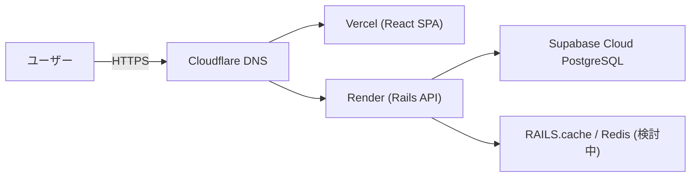
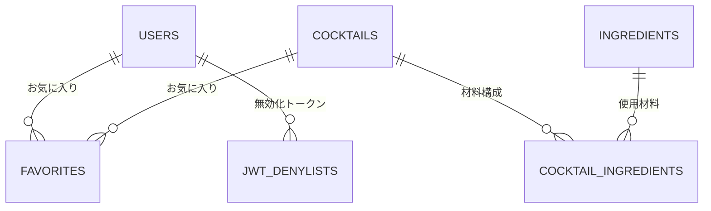
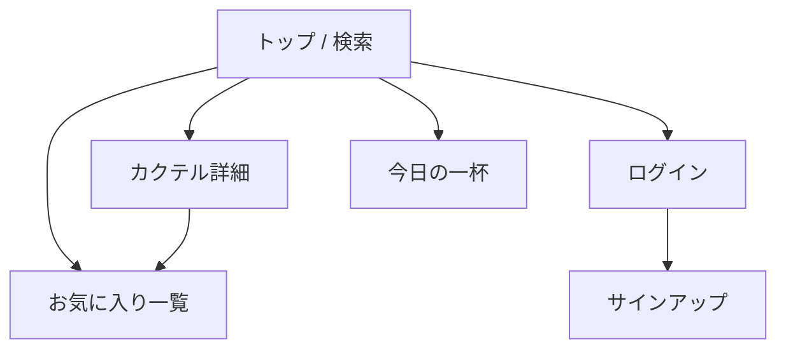

# Today's Cocktail - アプリ紹介

## サービス概要

Today's Cocktail は、「カクテルをもっと身近に」という思いから生まれたカクテルレシピ検索サービスです。  
ベース種類・材料・人気順など複数の軸でレシピ検索ができ、気に入った一杯はお気に入りとして保存できます。  
視覚的にわかりやすい画像と直感的な UI により、初心者でも安心して新しいカクテルに出会える体験を提供します。

### URL
https://todayscocktails.com

### ゲストユーザーアカウント
- Email: guestuser@example.com  
- Password: password123

---

## サービス開発の背景

海外のバーでドリンクを選ぶとき、名前だけでは味や見た目が想像できないカクテルがずらっと並び、注文に苦戦したことがアプリ開発のきっかけです。日本ではハイボールやレモンサワーが定番ですが、海外ではそういったメニューはほとんど存在せず、さらにメニューに写真が載っていないことも多いため、よく分からない名前だけを頼りに適当に注文してしまうことがよくありました。

困ったときはワインやビールを頼めば済むものの、せっかくなら幅広い種類のカクテルにも詳しくなり、自分でも自信を持ってバーで注文できるようになりたいと感じ、初心者向けのカクテル図鑑のようなアプリをつくりたいと感じました。本アプリでは、このような開発者自身の体験をもとに、初心者でも直感的に雰囲気が分かる画像や、カクテルの起源・由来・アルコール度数などの情報を分かりやすく整理し、安心して新しい一杯を選べることを目指しています。

---

## 主な実装機能

- カクテル一覧表示  
- カクテル詳細ページ（名前、説明文、画像、材料、レシピなどの詳細情報を表示）
- 検索・フィルタリング機能（ジン・ウォッカなどのベース種類や、使用材料による絞り込み）
- 日替わりで「今日の一杯」を提示するレコメンド機能
- 人気順でのソート機能
- ユーザー登録・ログイン機能
- お気に入り保存／お気に入り一覧表示（ログインユーザー限定）
- カクテル情報の作成・編集機能（管理者ユーザー限定）

---

## 使用技術一覧（Tech Stack）

| カテゴリ | 採用技術 |
|----------|-----------|
| フロントエンド | React 19 / TypeScript / Vite 7 / React Router 7 / Tailwind CSS 3 / shadcn/ui（Radix UI） |
| バックエンド API | Ruby 3.4.6 / Rails 8.0.3（API モード） |
| データベース | Supabase CLI / Cloud（PostgreSQL 17） |
| 認証 | Devise / devise-jwt |
| 外部API連携 | OpenAI API（生成・翻訳） / TheCocktailDB API（カクテル情報） / Unsplash API（画像） / Resend API（メール送信） |
| インフラ・ホスティング | Vercel（フロントエンド） / Render（バックエンド API） / Cloudflare DNS |
| CI/CD | GitHub Actions（lint / test） / Vercel & Render Deploy Hooks |
| テスト | Vitest 4（フロント） / RSpec（Rails API） |
| UI/UX デザイン | Figma / Figma Make |
| 開発支援・コード整形 | ESLint 9 / Prettier 3 / Husky 9 / lint-staged 16 / RuboCop |
| 開発環境 | Git / Docker / Docker Compose / VS Code / GitHub Copilot / Codex（Sonnet 4.5 / gpt-5 / gpt-5-codex） / Colima（軽量Docker環境） |

---

## インフラ構成図

---

## ER 図（抜粋）

テーブル定義の詳細は `docs/db_design.md` に記載。

---

## 画面遷移図（概要）

---

## 技術選定理由（抜粋）

- **Rails 8 (API モード)**  
  他のバックエンドフレームワークと比較して日本語の学習教材や導入事例が豊富である点が採用理由です。本プロジェクトはポートフォリオとしての活用も想定していたため、スタートアップ企業や未経験・ジュニア層での採用実績が比較的多い Ruby を選択しました。

- **React + Vite + TypeScript**  
  もともと JavaScript を学習していたことに加え、日本語の教材や採用実績が豊富で、現在主流のフロントエンド開発手法に合致している点から採用しました。Next.js も検討しましたが、Ruby と併用する場合は学習範囲が広がり負荷が増える可能性があること、また本プロジェクトでは複雑な要件が特にないため、よりシンプルに扱える React を選択しました。

- **Render / Vercel / Cloudflare**  
  当初は前職で使用経験のある AWS も検討しましたが、フロントとバックエンドでそれぞれ ECS Fargate を運用し、RDS を配置する構成では、最小スペックでも月額 6,000〜10,000 円ほどのコストが発生する見込みでした。個人開発として長く運用したいことから、低コストかつ小〜中規模アプリ向けの機能が充実している Render・Vercel・Cloudflare を組み合わせる構成を選択しました。

- **Supabase Cloud**  
  同様にコスト面を考慮し、無料で簡単に PostgreSQL 環境をデプロイできる点を評価しました。前職では MySQL の利用経験が中心でしたが、Supabase が PostgreSQL に特化していること、そして今後さらにシェアが伸びると見込まれる PostgreSQL を学習する良い機会になると考え採用しました。

---

## 工夫した点

### カクテル一覧・詳細・検索機能のパフォーマンス改善
最初の実装では、検索条件を変更するたびにほぼ全件のデータを取得してしまい、「動くけれど重い」という状態でした。とくに一覧ページでのスクロール時に引っかかりが発生していました。

そこで、検索条件ごとにクエリを最適化し、本当に必要なデータだけを取得するように改善しました。また、コンポーネントの責務を整理し、関係のないコンポーネントが再レンダリングされないように見直しています。画像には遅延ロードを採用し、まずはテキストだけでも素早く表示できるようにしました。

その結果、検索条件を切り替えても画面がもたつきにくくなり、「一覧から気になるカクテルをサクサク眺められる」体験に近づけられたと感じています。

### AI を使った材料・レシピ文のコンテンツ生成
当初は海外のオープンソースカクテルデータを英語で取得し、DeepL で日本語に翻訳して利用しようとしていました。しかし、海外と日本では材料の種類や量の単位が異なり、単に翻訳しただけでは「日本では使いづらいレシピ」になるケースが多くありました。

そこで、一度日本向けの材料や分量に整理し直した上で、その情報を OpenAI API に渡して説明文・レシピ文を生成し、自分で最終チェック・微修正するフローに変更しました。この方法により、日本のユーザーが実際に作りやすい内容にしつつ、カクテルの雰囲気も伝わる文章を効率よく用意できるようになりました。

### シンプルで迷わない UI/UX の設計
まず「ユーザーに何をしてほしいアプリなのか」を要件として整理し、Figma / Figma Make でプロトタイプを作成しながら導線や機能を固めていきました。

デザインの専門知識がまだ十分ではないため、レイアウトやコンポーネントは Tailwind CSS や shadcn/ui に寄せる方針を採用しました。基本的な余白・タイポグラフィなどはライブラリに任せつつ、自分でも納得できる見た目と使い勝手のバランスを取りやすくなりました。

その結果、「初めて触る人でも迷わず操作できる」シンプルな UI に近づけられたと感じています。

---

## 苦労した点

### Devise / JWT を用いた認証機能の実装
AI に相談しながら進めていたものの、認証周りの知識が浅く、「どこまでAIの提案を採用すべきか」「どれくらい自分で設計を詰めるべきか」で悩む場面が多くありました。

特に、トークンの保存場所、有効期限切れ時の扱い、ログアウト時にトークンをどのように無効化するかといった部分では、AI の案を参考にしつつ手を動かして検証し、公式ドキュメントを読みながら理解を深めました。

その過程で、「とりあえず動いているだけのコード」から、自分の言葉で認証の仕組みを説明できるレベルまで落とし込み、認証フローを組み立てられるようになってきたと実感しています。

### Lint・自動テストなど開発環境の整備と運用
ESLint / Prettier / Vitest / RSpec などの導入では、設定やバージョン相性によるエラーや「ローカルでは通るのに CI では落ちる」といったトラブルが複数発生しました。

Husky や lint-staged を用いて「コミット前のチェック」を徹底し、GitHub Actions で lint / test を自動実行する仕組みを整え、1つずつ問題を解決していきました。

時間はかかりましたが、今では新機能追加やリファクタリングの際も安心してコードを触ることができ、「作って終わり」ではなく継続的に育てやすいコードベースに近づけられたと感じています。

---

## 今後の開発ロードマップ

- カクテル画像アップロード機能の実装（現在は外部URLのみ取得）
- 「定番」「簡単」などのタグ付け機能の追加、およびフィルタリング項目への反映
- ソーシャルログイン機能（LINE / Google など）の導入
- コメント投稿機能の追加
- カクテルレシピの拡充
- プレミアムユーザー向け機能（課金）の導入

---

## 開発者

- Akito（iakito-dev）  
- GitHub: https://github.com/iakito-dev  
