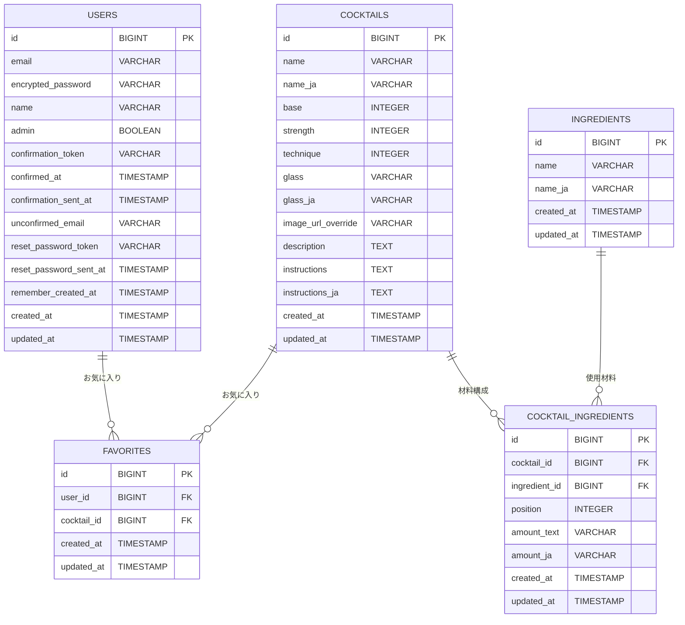

# Today's Cocktail - 今日の一杯が見つかるカクテルレシピ検索アプリ

## サービス概要

Today's Cocktail は、「カクテルをもっと身近に」という想いから生まれた、無料のカクテルレシピ検索サービスです。
ベースとなるお酒や材料、人気順など、複数の条件からレシピを検索でき、気に入った一杯はお気に入りとして保存できます。
誰でも迷わず使える直感的なUIと、「今日の一杯」をランダムに提案する機能により、カクテル初心者でも安心して新しいお酒に挑戦できる体験を提供しています。

### サービスURL

**https://todayscocktails.com**

レスポンシブ対応済のため、PCでもスマートフォン、タブレットでも快適にご利用いただけます。

### ゲストユーザーアカウント

- **Email**: `guestuser@example.com`
- **Password**: `password123`

お気に入り保存機能などログインが必要な機能を試す際にご活用ください。

---

## サービス開発の背景

開発者自身、休日の趣味や気分転換として外に一杯飲みに行くことが好きなのですが、いつもビールやワインなど同じメニューを頼んでしまい、どこかマンネリを感じていました。また、海外生活や旅行の中で現地のバーに行くと、「ネグロニ」や「オールドファッション」など、日本の居酒屋ではあまり見かけないカクテルがメニューに並んでいることが多く、興味はあるものの味や見た目のイメージがつかず、注文を躊躇してしまうことがよくありました。

「いつかはカクテルを勉強して、もっといろいろな種類のドリンクを楽しめるようになりたい」と思いながらも、日本語で気軽にカクテルを学べるサービスがなかなか見つからず、あるとしても「広告が多く使いづらい」、「情報量が多すぎて初心者には難しい」「デザインが古くユーザー体験が悪い」といった印象が強く、理想的なアプリやサービスが見つからない状況でした。

それなら、カクテル初心者向けに日本語でわかりやすく情報が整理された、シンプルでモダンなカクテル図鑑アプリを自分で作ろう！と思い、開発することにしました。

---

## 主な実装機能

### カクテル一覧表示機能

現時点で登録済みのレシピ40種類以上を閲覧することができます。人気順での並び替えも可能です。

### カクテル詳細ページ表示機能

カクテル名、由来などの説明文、カクテルごとの画像、材料一覧、レシピなどの詳細情報を表示します。

### 日替わりレコメンド機能

「今日の一杯」を日替わりでランダムに提案します。

### 検索・フィルタリング機能

カクテル名・材料のキーワード検索に加え、ベースとなるお酒・つくりかた・アルコール度数でのフィルタリングが可能です。

### お気に入り機能

気に入ったカクテルを保存して一覧表示できます。（ログインユーザー限定）

### ユーザー認証機能

ユーザー登録・ログイン・パスワードリセットが可能です。

### アカウント設定機能

アカウント設定画面から、ユーザー名・パスワード変更が可能です。

### 管理者機能

詳細画面からカクテル情報の編集が可能です。（管理者ユーザー限定）

---

## 使用技術一覧（Tech Stack）

| カテゴリ               | 採用技術                                                                                                                        |
| ---------------------- | ------------------------------------------------------------------------------------------------------------------------------- |
| フロントエンド         | React 19 / TypeScript / Vite 7 / React Router 7 / Tailwind CSS 3 / shadcn/ui（Radix UI）                                        |
| バックエンド API       | Ruby 3.4.6 / Rails 8.0.3（API モード）                                                                                          |
| データベース           | Supabase CLI / Cloud（PostgreSQL 17）                                                                                           |
| 認証                   | Devise / devise-jwt                                                                                                             |
| 外部API連携            | OpenAI API（生成・翻訳） / TheCocktailDB API（カクテル情報） / Unsplash API（画像） / Resend API（メール送信）                  |
| インフラ・ホスティング | Vercel（フロントエンド） / Render（バックエンド API） / Cloudflare DNS                                                          |
| CI/CD                  | GitHub Actions（lint / test） / Vercel & Render Deploy Hooks                                                                    |
| テスト                 | Vitest 4（フロント） / RSpec（Rails API）                                                                                       |
| UI/UX デザイン         | Figma / Figma Make                                                                                                              |
| 開発支援・コード整形   | ESLint 9 / Prettier 3 / Husky 9 / lint-staged 16 / RuboCop                                                                      |
| 開発環境               | Git / Docker / Docker Compose / VS Code / GitHub Copilot / Codex（Sonnet 4.5 / gpt-5 / gpt-5-codex） / Colima（軽量Docker環境） |

---

## インフラ構成図

- **ホスティング**: 運用コストを抑えるため、フロントエンドは Vercel、バックエンドは Render、データベースは Supabase Cloud（PostgreSQL）を採用しました。いずれも無料プランでの運用が可能です。
- **デプロイフロー**: GitHub の main ブランチに Push すると GitHub Actions が自動で lint / test を実行し、すべてのチェックを通過した場合にのみ Vercel（フロントエンド）および Render（バックエンド）へ自動デプロイされます。
- **DNS 管理**: 独自ドメインは Cloudflare DNS で管理しています。
- **データストア**: バックエンド API から Supabase Cloud（PostgreSQL）へ接続してデータを保存・取得します。また必要に応じて Rails.cache を利用し、応答速度とパフォーマンスを向上させています。
- **外部 API 連携**: バックエンドから以下の外部 API を利用しています。
  - OpenAI API（説明文生成・翻訳）
  - Unsplash API（画像取得）
  - Resend API（メール送信）
  - TheCocktailDB API（カクテル情報）

---

## ER 図

- **USERS**
  ユーザーアカウント情報を管理するテーブルです。メールアドレス・パスワード・管理者フラグ・認証関連のトークンなどを保存しています。

- **COCKTAILS**
  カクテルの基本情報を格納するメインテーブルです。名前、ベース種、度数、作り方、説明文、画像 URL などを管理します。

- **INGREDIENTS**
  材料のマスターデータ。材料名（日本語・英語）を保持。
  ※カクテルとは直接紐付かず、中間テーブルを介して多対多関係を形成。

- **COCKTAIL_INGREDIENTS**
  カクテルと材料を結びつける中間テーブルです。
  どのカクテルにどの材料がどれくらい必要か（分量）を管理し、さらに position により表示順序も保持しています。

- **FAVORITES**
  ユーザーがお気に入り登録したカクテルを管理する中間テーブルです。
  1ユーザーは複数のお気に入りを持つことができ、1カクテルは多くのユーザーにお気に入り登録される可能性があります。

---

## 採用技術の選定理由

今回開発したアプリで使用している技術を採用した理由について記載します。基本的な選定軸としては以下です。

1.  スタートアップやメガベンチャー等、多くのWebサービス企業で採用実績があること
2.  日本語での学習教材や公式ドキュメントが豊富で、情報をキャッチアップしやすいこと
3.  個人開発でも継続して運用しやすく、学習コスト・費用・環境構築の面でボトルネックにならないこと

---

### バックエンド: Ruby / Ruby on Rails (API モード)

#### 検討技術

- TypeScript / Node.js / Go / PHP / Java 等

#### 採用理由

- Progate や Rails チュートリアルなど初学者向け教材が充実しており、他フレームワークと比較しても学習開始のハードルが低いこと
- 開発効率が高く短期間で MVP を構築しやすい特性から、2025年現在も Web 系スタートアップを中心に採用され続けており、未経験・ジュニア層向け求人も比較的多いこと
- オブジェクト指向や MVC の設計思想を学ぶことで、他の言語・フレームワークにも応用しやすい基礎を身につけられること

#### 懸念点

- モノリシック構成になりやすく、マイクロサービス化しにくい
  → 小規模 Web サービスであり、運用上の問題はないと判断
- 動的型付け言語であるため、型安全性に課題がある
  → RSpec を用いたテストで品質を担保する方針とした

---

### フロントエンド: TypeScript / React

#### 検討技術

- Ruby on Rails (Hotwire) / Vue.js / Next.js 等

#### 採用理由

- 過去に JavaScript / React を学習した経験があり、キャッチアップが容易だったため
- 一般的な企業でも React / TypeScript の採用が主流化しており、学習教材・コミュニティが豊富であること
- Next.js についても検討したが、Rails と組み合わせた場合、API ルーティングや SSR / SSG の責務分離が複雑化する可能性があると判断し、本プロジェクトではよりシンプルに運用できる React を採用した

#### 懸念点

- Next.js の Image Optimization などの最適化機能が利用できない
  → 本プロジェクトは SEO 要件や SSG / ISR を必要としない構成であり、MVP作成段階では追加の学習コストに見合うメリットが小さいと判断して見送り（今後導入・移行することも検討中）

---

### インフラ: Render / Vercel / Supabase

#### 検討技術

- AWS（ECS Fargate, RDS）等

#### 採用理由

- 過去の AWS 経験や Terraform などの IaC 活用も見込んで当初は AWS 構成を検討していたが、フロントとバックエンドをそれぞれ ECS Fargate で運用し、RDS を配置する構成では最小スペックでも月額 6,000〜10,000 円規模のランニングコストが発生する見込みであったため断念
- 今後も継続して開発・運用したい個人プロジェクトであることから、低コストでデプロイ・ホスティング・データベースを一気通貫で扱える Render / Vercel / Supabase の組み合わせを採用した

#### 懸念点

- Render / Vercel の無料枠・小規模プランでは、同時接続数やスケール性能に制限がある
  → 個人プロジェクトのユースケースでは十分と判断
- Render・Vercel・Supabase の 3 つのサービスにまたがって運用する構成となるため、設定管理やトラブルシューティングが分散しやすい
  → IaC での完全な一元管理は難しいが、費用面でのメリットを考慮し個人開発の規模では許容できると判断。また、各プラットフォームの UI（デプロイ操作やログ確認など）に実際に触れ、使いやすさを感じたことも理由

---

### DBエンジン: Supabase Cloud（PostgreSQL）

#### 検討技術

- RDS / Aurora MySQL 等

#### 採用理由

- 前職で扱っていた RDS / Aurora（MySQL 系）を利用できれば、既存の運用知識を活かせる点でメリットが大きいと考えていたが、個人開発として継続運用するにはコストが高く現実的ではないため断念
- Supabase の無料枠では PostgreSQL のみが提供されており、環境構築の手軽さ・追加料金なしでの運用が可能だったこと
- PostgreSQL は拡張機能が豊富で世界的にもシェアが伸びているため、今後のキャリアにおいて学習リターンが大きいと判断

---

### CI / CDツール : GitHub Actions

#### 検討技術

- AWS Codeシリーズ など

#### 採用理由

- GitHub とネイティブに連携でき、設定がシンプルで扱いやすかったため
- 無料枠が十分で、個人開発でも運用コストを気にせず利用できるため

---

### 認証 : devise(gem)

#### 検討技術

- Supabase Auth / Firebase Authentication など

#### 採用理由

- Railsチュートリアルでログイン機能の実装を実践したこともあり、せっかくなら認証部分を自分で実装する経験を積みたいと考えたため

---

## 工夫した点

### AI を使った材料・レシピ文のコンテンツ生成

**課題**

当初は海外のオープンソースカクテルデータを英語で取得し、DeepL で日本語に翻訳して利用しようとしていました。しかし、海外と日本では材料の種類や量の単位が異なり、単に翻訳しただけでは「日本では使いづらいレシピ」になるケースが多くありました。

**解決策**

一度日本向けの材料や分量に整理し直した上で、その情報を OpenAI API（GPT-5）に渡して説明文・レシピ文を生成し、自分で最終チェック・微修正するフローに変更しました。

**工夫した点**

- プロンプト設計を工夫し、翻訳ルールを明確に定義して一貫性のある結果を得る
- バッチ処理で複数材料を一度に翻訳し、API呼び出し回数を削減
- エラーハンドリングを実装し、API呼び出しが失敗しても処理を継続できるように

**結果**

日本のユーザーが実際に作りやすい内容にしつつ、カクテルの雰囲気も伝わる文章を効率よく用意できるようになりました。手動で翻訳・校正する時間を大幅に削減できました。

### AI開発支援ツールの積極的な活用

**取り組み**

このプロジェクトでは、GitHub Copilot、Codex（Sonnet 4.5 / gpt-5 / gpt-5-codex）、Cursor、Figma Make など、今後主流になっていくであろうAI技術を積極的に活用しました。

**工夫した点**

- **GitHub Copilot / Codex / Cursor**: コード生成やリファクタリングの提案を受けながら、自分でも理解して使い分けられるように意識して使用
- **Figma Make**: UIデザインの自動生成やプロトタイプ作成を効率化
- AIの提案をそのまま採用するのではなく、必ず自分で理解し、必要に応じて修正・改善する姿勢を徹底

**学び**

開発未経験である自分でもAIの力を借りてここまでのアプリを作成できることは驚きでした。一方で、AIが高速で生成する情報を都度理解しようとすると意外と大変でした。

AIにすべて任せるのではなく、知らないトピックやコードが出てきたら都度AIに質問を投げかけて理解しようと意識することが今の開発においては重要だと感じました。この姿勢を徹底することで、今後もエンジニアとして爆速的に成長できるかもしれないと実感しています。

### カクテル一覧・詳細・検索機能のパフォーマンス改善

**課題**

最初の実装では、検索条件を変更するたびにほぼ全件のデータを取得してしまい、「動くけれど重い」という状態でした。とくに一覧ページでのスクロール時に引っかかりが発生していました。

**取り組んだ改善**

- 検索条件ごとにクエリを最適化し、本当に必要なデータだけを取得するように改善
- Rails.cache を活用した12時間キャッシュでDB負荷を削減
- コンポーネントの責務を整理し、関係のないコンポーネントが再レンダリングされないように見直し
- 画像には遅延ロードを採用し、まずはテキストだけでも素早く表示できるように改善
- N+1問題の回避：`includes`や`left_joins`で関連データを事前読み込み

**結果**

検索条件を切り替えても画面がもたつきにくくなり、「一覧から気になるカクテルをサクサク眺められる」体験に近づけられました。特に、キャッシュの導入により、同じ検索条件での2回目以降のアクセスが大幅に高速化されました。

---

## 苦労した点

### Devise / JWT を用いた認証機能の実装

**課題**

AI に相談しながら進めていたものの、認証周りの知識が浅く、「どこまでAIの提案を採用すべきか」「どれくらい自分で設計を詰めるべきか」で悩む場面が多くありました。

**特に苦労した点**

- **トークンの保存場所**：localStorage vs sessionStorage vs Cookie の選択
- **有効期限切れ時の扱い**：フロントエンドとバックエンドの両方で適切にハンドリングする方法
- **ログアウト時のトークン無効化**：JWT はステートレスなため、無効化リスト（denylist）を実装する必要があった

**解決プロセス**

AI の案を参考にしつつ手を動かして検証し、公式ドキュメントを読みながら理解を深めました。特に、`devise-jwt` の仕組みを理解するために、JWT の構造や署名・検証の流れを実際にコードを書いて確認しました。

**学び**

その過程で、「とりあえず動いているだけのコード」から、自分の言葉で認証の仕組みを説明できるレベルまで落とし込み、認証フローを組み立てられるようになってきたと実感しています。セキュリティの重要性も改めて実感しました。

### Lint・自動テストなど開発環境の整備と運用

**課題**

ESLint / Prettier / Vitest / RSpec などの導入では、設定やバージョン相性によるエラーや「ローカルでは通るのに CI では落ちる」といったトラブルが複数発生しました。

**具体的な問題**

- ESLint 9 と Prettier 3 の設定の競合
- Vitest と Vite のバージョン相性問題
- GitHub Actions での Node.js バージョンとローカルの不一致
- RSpec のテスト環境と本番環境の違いによるエラー

**解決プロセス**

Husky や lint-staged を用いて「コミット前のチェック」を徹底し、GitHub Actions で lint / test を自動実行する仕組みを整え、1つずつ問題を解決していきました。特に、CI 環境をローカル環境と一致させることで、多くの問題を解決できました。

---

## 今後の開発ロードマップ

- カクテル画像アップロード機能の実装（現在は外部URLのみ取得）
- 「定番」「簡単」などのタグ付け機能の追加、およびフィルタリング項目への反映
- ソーシャルログイン機能（LINE / Google など）の導入
- コメント投稿機能の追加
- カクテルレシピの拡充
- プレミアムユーザー向け機能（課金）の導入

---

## 開発者

**伊藤 彬人（Akito Ito / iakito-dev）**

- **GitHub**: [https://github.com/iakito-dev](https://github.com/iakito-dev)
- **ポートフォリオ**: [https://iakito-dev.github.io/Resume_JP/](https://iakito-dev.github.io/Resume_JP/)
- **サービスURL**: [https://todayscocktails.com](https://todayscocktails.com)
