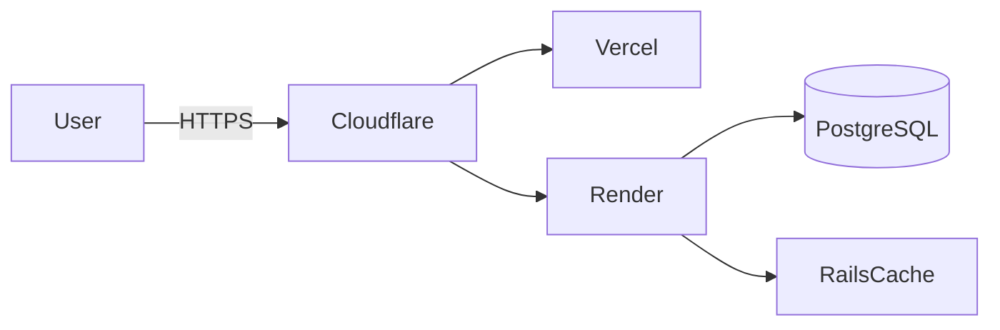

# カクテルをもっと身近に。カクテル検索サービス「Today’s Cocktail」

## TL;DR

- 「カクテルをもっと身近に」。バーで「何にしよう…」と迷う30秒と、家で「何が作れるんだっけ？」を減らすために生まれたカクテル検索アプリです。
- React 19 + Rails 8（API）+ Supabase 構成。日替わりおすすめと英日併記レシピで、初めてでも“味の当たり”をつけやすくしました。
- 認証・キャッシュ・CI まで一人で設計〜運用。学びと実用の両立を意識して継続改善中です。

---

## 1. プロジェクト概要

| 項目         | 内容                                                                                                                                                |
| ------------ | --------------------------------------------------------------------------------------------------------------------------------------------------- |
| プロダクト名 | Today’s Cocktail                                                                                                                                    |
| URL          | https://todayscocktails.com                                                                                                                         |
| 体制         | 個人開発（企画 / デザイン / 実装 / ドキュメント）                                                                                                   |
| 開発状況     | 2025-11-12 時点で継続運用中                                                                                                                         |
| 役割         | Product Owner / Full-stack Engineer                                                                                                                 |
| 技術スタック | React 19 / TypeScript / Vite / Tailwind CSS / shadcn/ui / Ruby 3.4.6 / Rails 8.0.3 API / Supabase Cloud (PostgreSQL) / Render / Vercel / Cloudflare |

---

## 2. きっかけと解きたかった課題

合言葉は「カクテルをもっと身近に」。
きっかけは、行きつけのバーで毎回「今日はどんな気分？」と聞かれて答えに詰まる自分でした。メニューの名前だけでは味の輪郭が掴めず、結局いつもの一杯に落ち着いてしまう。家では家で、手元の材料から作れるレシピがすぐ出てこない——そんな小さな“迷い”が積もっていました。

解きたかったのはこの 2 点です。

- 名前に引っぱられずに、ベース酒や材料・気分から“今の一杯”へ最短で辿り着くこと。
- 手元の材料だけで作れる選択肢が一目で分かること（英日併記で読みやすく）。

そこで「3 タップ以内で候補に辿り着ける検索」「10 秒で雰囲気が掴めるレシピ表示」を目標に情報設計を行いました。

Before / After（目指した体験）

- Before: 名前検索で迷子になる、味の想像がつかない、材料が足りるか分からない。
- After: ベース酒 + 材料キーワード + 人気順で素早く絞り込み、英日併記レシピで雰囲気を掴み、作れるものだけを即表示。

---

## 3. ユーザー体験フロー

1. トップで「ベース酒」「材料キーワード」「人気順」を組み合わせて検索（目標: 3 タップ / 10 秒）。
2. 気になる一杯を開き、英日併記の材料・分量・手順で味のイメージを掴む。
3. ログイン中ならお気に入りに保存し、次回は“迷わない一覧”から選ぶ。
4. 何も決まらない日は「今日の一杯」で出会いを作る。

---

## 4. 主要機能

| カテゴリ                   | 概要                                                                                    |
| -------------------------- | --------------------------------------------------------------------------------------- |
| 多軸検索とページネーション | ベース酒（単複選択）、材料 AND 絞り込み、人気順ソート、最大 100 件のページング。        |
| 今日の一杯（レコメンド）   | 24 時間キャッシュで毎日 1 杯をピックアップし、トップに表示。                            |
| レシピ詳細                 | 材料リストを英日併記・分量順で提示し、初心者でも作りやすいガイドを提供。                |
| お気に入り / JWT 認証      | Devise + devise-jwt によるメール確認付きサインアップ、JWT denylist で安全にログアウト。 |
| 管理者 API                 | カクテル情報の更新時に一覧・詳細・レコメンドのキャッシュを一括クリア。                  |

---

## 5. アーキテクチャと技術選定

- **フロント**: React 19 + Vite。Tailwind CSS と shadcn/ui のコンポーネントを組み合わせ、レスポンシブでカード中心の UI を実装。
- **バックエンド**: Rails 8 API モード。`ActionController::API` で軽量化し、キャッシュ層を組み込んだ RESTful API を提供。
- **データ**: Supabase Cloud (PostgreSQL 15)。Rails から `DATABASE_URL` で接続し、材料構成は `cocktail_ingredients` の多対多で管理。
- **インフラ**: Render（API）、Vercel（フロント）、Cloudflare（DNS / CDN）。Docker Compose でローカル同等の環境を再現。
- **CI/CD**: GitHub Actions で lint / test / build を自動実行。Vercel / Render と連携して main ブランチからデプロイ。
- **ドキュメント / デザイン**: `docs/` で要件・技術を管理し、Figma にワイヤーと UI キットを蓄積。

---

## 6. 実装ハイライト（課題→解決）

1. 迷いがちな初手 → 「今日の一杯」で日替わりの入り口を用意（24 時間キャッシュ）。
2. 名前だけでは伝わらない → 英日併記の材料・手順で“味の想像”をサポート。
3. 作れるか不安 → 材料 AND 絞り込みで“手元で作れる”候補だけを一覧化。
4. 安全に使いたい → Devise + JWT denylist、未確認メールは発行不可にして安心。
5. 継続改善しやすく → ドキュメント駆動で仕様を常に最新化、変更の意図が追える。

---

## 7. 開発プロセス

| フェーズ | 内容                                                                                                              |
| -------- | ----------------------------------------------------------------------------------------------------------------- |
| リサーチ | 既存のカクテルレシピ本やバーのメニュー構成を調査し、検索軸と表示要素を洗い出し。                                  |
| 設計     | ユースケース / ER / 画面遷移を Notion + Figma で定義。`docs/` 配下に仕様を残し、レビューコメントを履歴管理。      |
| 実装     | Rails API と React SPA を並行実装し、共通のリクエスト/レスポンス定義を `docs/functional_requirements.md` で同期。 |
| 品質保証 | Rails: request spec / RuboCop。React: Vitest + Testing Library。CI で自動実行し main へマージ。                   |
| 運用     | Cloudflare で SSL / DNS、Render / Vercel のモニタリングを活用。ログ監視は次フェーズで拡充予定。                   |

---

## 8. 得られた学び

- **課題は自分の生活から拾う**: “迷う 30 秒”を言語化すると、要件がブレにくく意思決定が早い。
- **検索 UX**: 材料 AND 絞り込みと人気順で“選べるけど迷わない”バランスに近づいた。
- **キャッシュ戦略**: TTL を機能ごとに分けると鮮度と負荷のトレードオフを説明しやすい。
- **ドキュメント整備**: 設計理由を残すことで、未来の自分が迷わない。

---

## 9. 今後のロードマップ

1. `/api/v1/ingredients` を外部公開し、オートコンプリートと連携。
2. 画像アップロード（Supabase Storage or Active Storage + S3）を導入し、ユーザー投稿にも拡張。
3. Playwright での E2E、自動レグレッションテストの整備。
4. Terraform で Render/Vercel の構成をコード化し、Sentry + Logflare で可観測性を高める。
5. 味わいタグやレビュー機能でパーソナライズ精度を向上。

---

## 10. 参考リンク

- ソースコード: https://github.com/iakito-dev/todays-cocktail
- 設計ドキュメント: `docs/functional_requirements.md`, `docs/tech_stack.md`, `docs/db_design.md`
- デザイン: Figma（ワイヤー / UI コンポーネント）
- モニタリングメモ: `docs/frontend-backend-integration.md`（API ⇔ UI の責務整理）

---

## 11. 参考にしたポートフォリオ記事

- [元高校球児のためのスコア管理サービス開発ログ（@ippei_jp）](https://qiita.com/ippei_jp/items/c3a10d7e3142723fae30)
- [ビジネス視点で語るポートフォリオ記事（@fuku_pg）](https://qiita.com/fuku_pg/items/bd3556958b0b4a987af2)
- [課題 → 解決策の流れを徹底した記事（@keynyaan）](https://qiita.com/keynyaan/items/64a350cd409f40895bde)

これらの構成（課題提示→成果→技術詳細→学び→今後）を踏襲し、採用担当者が短時間で要点を把握できるよう章立てを最適化した。

---

## 12. 採用担当者さまへ

このプロダクトは「カクテルをもっと身近に」を核に、小さな不便を丁寧に解く姿勢で磨き込みました。使い心地や改善アイデアをぜひフィードバックいただけると嬉しいです。3 分だけでも、トップ→検索→詳細の流れを触ってみてください。迷いが少し軽くなる体験を目指しています。
