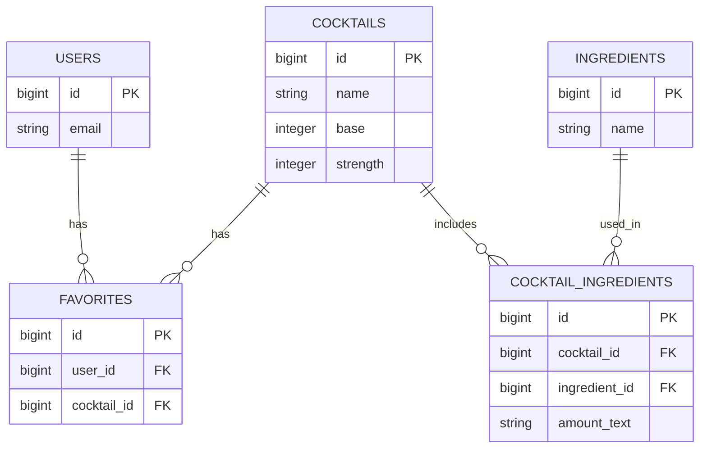

# データベース設計（Database Design）

## ER図

---

## users
Deviseによるユーザーアカウント管理。
将来的にお気に入り機能・認証機能で利用。

| カラム名 | 型 | 制約 | 説明 |
|-----------|----|------|------|
| id | bigint | PK | ユーザーID |
| email | string | not null, unique | メールアドレス（ログイン用） |
| encrypted_password | string | not null | パスワードハッシュ（Devise管理） |
| created_at | datetime |  | 作成日時 |
| updated_at | datetime |  | 更新日時 |

---

## cocktails
各カクテルの基本情報。
ベース、強度、グラス、技法は enum で定義。
表示・検索の中心となるメインテーブル。

| カラム名 | 型 | 制約 | 説明 |
|-----------|----|------|------|
| id | bigint | PK | カクテルID |
| name | string | not null, index | カクテル名（例: マティーニ） |
| base | integer | not null, default: 0 | ベース（enum: ジン、ラム、ウイスキー等） |
| strength | integer | not null, default: 0 | アルコール強度（enum: ライト／ミディアム／ストロング） |
| technique | integer | not null, default: 0 | 作り方（enum: ビルド／ステア／シェイク） |
| image_url_override | string |  | 外部画像URL（Active Storage画像が無い場合の手動設定用） |
| instructions | text |  | レシピ手順（文章） |
| created_at | datetime |  | 作成日時 |
| updated_at | datetime |  | 更新日時 |

**Index**
- (name)
- (base)
- (strength)

---

## ingredients
材料マスタ。
同じ材料名を複数のカクテルが参照する。

| カラム名 | 型 | 制約 | 説明 |
|-----------|----|------|------|
| id | bigint | PK | 材料ID |
| name | string | not null, unique | 材料名（例: ドライジン, ライムジュース） |
| created_at | datetime |  | 作成日時 |
| updated_at | datetime |  | 更新日時 |

---

## cocktail_ingredients
カクテルと材料の中間テーブル。
量（テキスト or 数値）や表示順を保持。

| カラム名 | 型 | 制約 | 説明 |
|-----------|----|------|------|
| id | bigint | PK | レコードID |
| cocktail_id | bigint | not null, FK(cocktails.id) | カクテルID |
| ingredient_id | bigint | not null, FK(ingredients.id) | 材料ID |
| amount_text | string | not null | 分量（例: "45ml", "適量"） |
| amount_ml | decimal(6,2) |  | 数値換算（例: 45.00）※任意 |
| unit | string |  | 単位（例: "ml", "tsp"）※任意 |
| position | integer |  | 材料の表示順 |
| created_at | datetime |  | 作成日時 |
| updated_at | datetime |  | 更新日時 |

**Index**
- (cocktail_id, ingredient_id) unique

補足:
`amount_text` を主に使用（可読性重視）。
数値比較が必要になった場合は `amount_ml` を活用。

---

## favorites
ユーザーのお気に入りカクテルを管理する中間テーブル。
1ユーザーが同じカクテルを重複登録できないよう制約を付与。

| カラム名 | 型 | 制約 | 説明 |
|-----------|----|------|------|
| id | bigint | PK | お気に入りID |
| user_id | bigint | not null, FK(users.id) | ユーザーID |
| cocktail_id | bigint | not null, FK(cocktails.id) | カクテルID |
| created_at | datetime |  | 作成日時 |
| updated_at | datetime |  | 更新日時 |

**Index**
- (user_id, cocktail_id) unique

---

## 設計のポイント

1. **正規化を意識した構造**
   - カクテル、材料、ユーザーを独立させて中間テーブルで多対多を表現。
   - 同じ材料を複数のカクテルが参照可能。

2. **enumの活用**
   - `base`, `strength`, `technique` は整数で保持しつつ、表示時にラベル変換可能。
   - 表示用は I18n で管理。

3. **量の柔軟な扱い**
   - `amount_text` は可読性重視（例: “適量”, “1tsp”）。
   - `amount_ml` は数値検索・統計分析用途。

4. **拡張性の確保**
   - ActiveStorageで画像アップロード対応可。
   - タグ、レビュー、コメント機能など中間テーブルで容易に拡張可能。

5. **パフォーマンス考慮**
   - 検索でよく使うカラムにインデックス追加。
   - 中間テーブルにはユニーク制約を付与。

6. **お気に入り機能の安全設計**
   - `(user_id, cocktail_id)` の複合ユニーク制約を設定。
   - 重複登録を防止。

---

## この設計の特徴
- RailsのActiveRecordリレーションで自然に扱える構成。
- APIモード（`/api/v1/cocktails`など）にも最適化。
- 今後の拡張（タグ、レビュー、画像アップロード）にも柔軟に対応可能。
- 実装時は `includes(:ingredients)` によりN+1問題を回避。
- `ActiveAdmin` や `seed` データ導入にもスムーズに対応。
